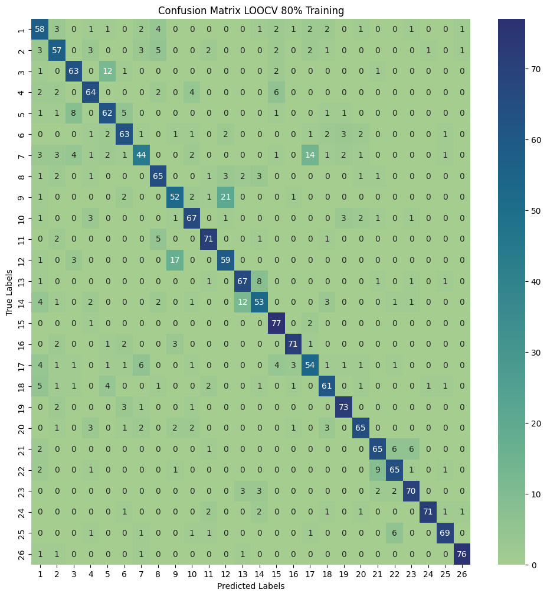
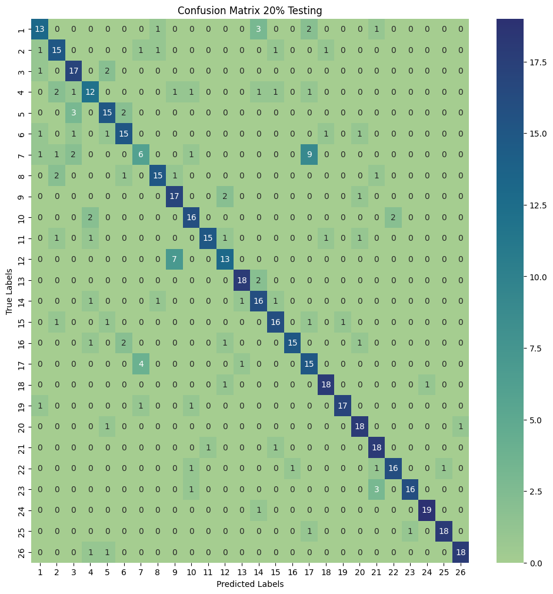
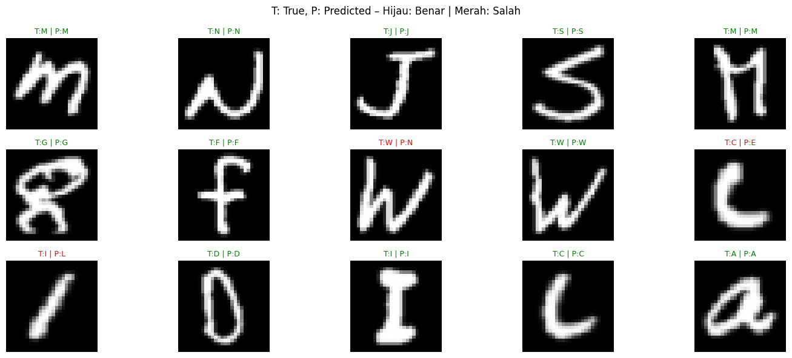

# Handwritten Character Classification using EMNIST, HOG, and SVM

## Description

This project implements handwritten character classification using the EMNIST Letters dataset. Feature extraction is performed using Histogram of Oriented Gradients (HOG), while classification is carried out using Support Vector Machine (SVM).

The project also applies parameter tuning for both HOG and SVM to obtain the best classification performance. Model evaluation is performed using Leave-One-Out Cross Validation (LOOCV).

---

## Dataset Source

Dataset used in this project is obtained from Kaggle:

https://www.kaggle.com/datasets/crawford/emnist

Dataset information:

* EMNIST Letters
* 26 handwritten character classes (A-Z)
* 100 samples per class
* Total samples used: 2600

---

## Methods

### 1. Data Preprocessing

The preprocessing steps include:

* Loading EMNIST dataset
* Balancing dataset (100 samples per class)
* Shuffling dataset
* Splitting dataset into training and testing data

---

### 2. HOG Feature Extraction

Histogram of Oriented Gradients (HOG) is used for feature extraction.

Modified HOG Parameters:

* orientations = 9
* pixels_per_cell = (8,8)
* cells_per_block = (2,2)

These parameters are tuned to improve feature representation and classification performance.

---

### 3. Support Vector Machine (SVM)

Support Vector Machine (SVM) is used as the classifier.

SVM Parameters:

* kernel = rbf
* C = 2.4
* gamma = scale

Parameter tuning is performed using GridSearchCV.

---

### 4. Evaluation Method

The model evaluation uses:

* Leave-One-Out Cross Validation (LOOCV)
* Confusion Matrix
* Accuracy
* Precision
* Recall
* F1-Score

---

## Evaluation Results

### LOOCV Evaluation

* Accuracy : 79.90%
* Precision : 80.01%
* Recall : 79.90%
* F1-Score : 79.84%

The model successfully classifies handwritten characters with good performance despite variations in handwriting styles.

---

## Result Visualization

### LOOCV Confusion Matrix



---

### Testing Confusion Matrix



---

### Character Prediction Result



Example visualization:

* T = True Label
* P = Predicted Label

The model successfully predicts most handwritten characters correctly, although several characters with similar shapes are still difficult to classify.

## How to Run

### 1. Clone Repository

```bash
git clone <repository-link>
```

### 2. Open Jupyter Notebook

```bash
jupyter notebook
```

### 3. Run Notebook

Run:

* `Midterm_Vision.ipynb`

---

## Repository Structure

```text
project/
│
├── data/
├── images/
│   ├── Confusion_Matrix_loocv.png
│   ├── Confusion_Matrix_testing.png
│   └── Result.png
│
├── source/
│   └── Midterm_Vision.ipynb
│
└── README.md
```